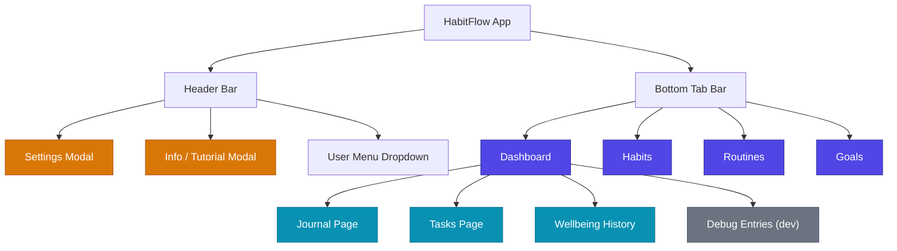
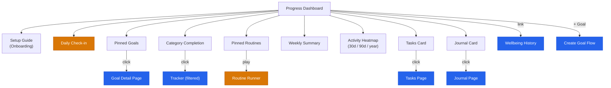
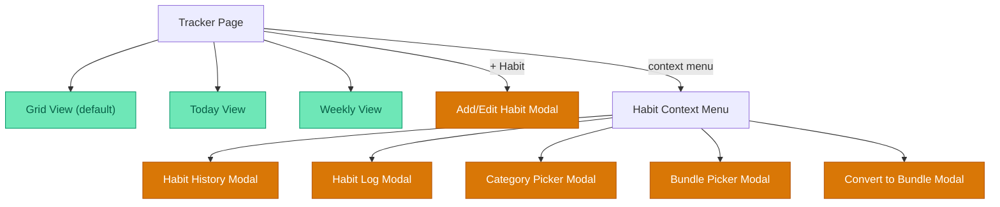
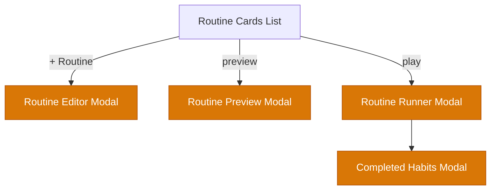
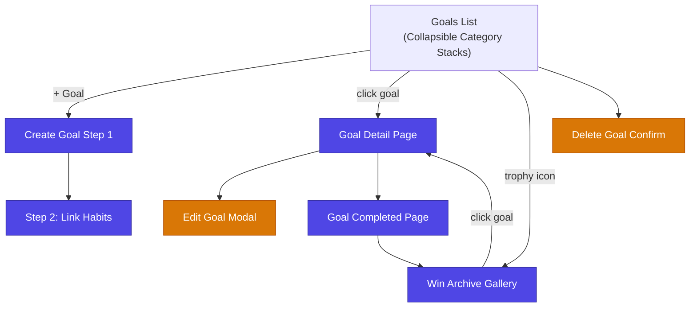
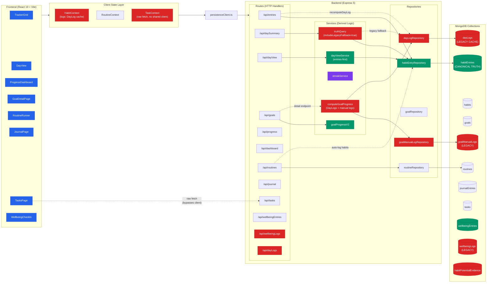
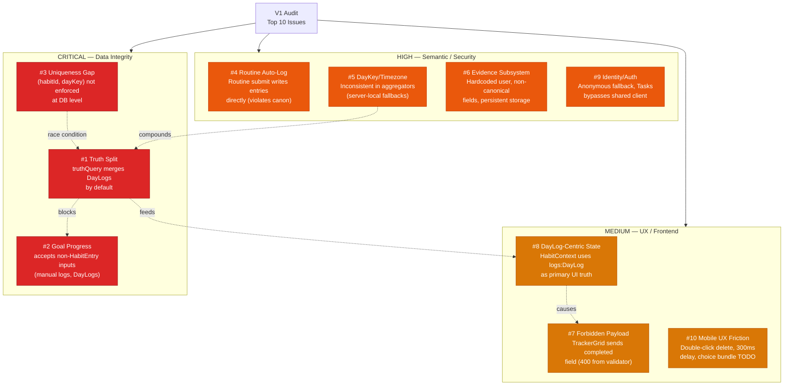
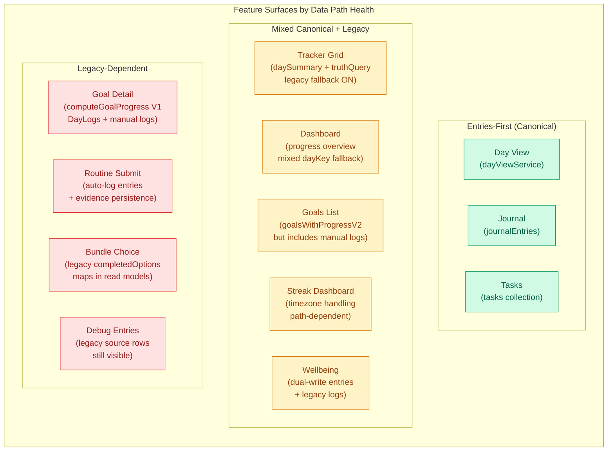
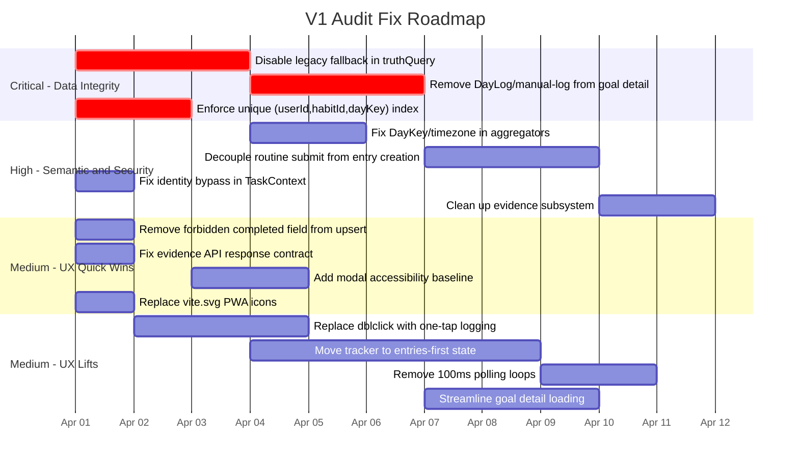

# HabitFlow UI Audit — Visual Diagrams

Generated from the V1 audit findings. These Mermaid diagrams capture information architecture, data flow, issue mapping, and UX pain points.

---

## 1. Information Architecture & Navigation Map

### 1a. App Shell & Primary Navigation

### 1b. Dashboard Domain

### 1c. Habits / Tracker Domain

### 1d. Routines Domain

### 1e. Goals Domain

---

## 2. Data Architecture & Canonical Truth Flow

---

## 3. Audit Issue Severity Map

---

## 4. UX Pain Points & Interaction Model

```mermaid
graph TB
    classDef pain fill:#FEE2E2,stroke:#DC2626,color:#991B1B
    classDef fix fill:#D1FAE5,stroke:#059669,color:#065F46
    classDef flow fill:#DBEAFE,stroke:#2563EB,color:#1E40AF

    subgraph LOGGING["Habit Logging (Core Flow)"]
        direction TB
        LOG_GRID["Grid View Logging"]:::flow
        LOG_DAY["Day View Logging"]:::flow
        LOG_ROUTINE["Routine-Based Logging"]:::flow

        PAIN_1["300ms click delay +\ndouble-click delete\n(touch hostile)"]:::pain
        PAIN_2["Choice bundle state\nis TODO in Day View"]:::pain
        PAIN_3["Routine auto-logs\nhabits (blurs support\nvs completion)"]:::pain

        LOG_GRID --> PAIN_1
        LOG_DAY --> PAIN_2
        LOG_ROUTINE --> PAIN_3

        FIX_1["One-tap toggle model\nLong-press for edit/delete"]:::fix
        FIX_2["Unify logging interaction\nacross Grid + Day view"]:::fix
        FIX_3["Routine = end session\nHabits = explicit checklist"]:::fix

        PAIN_1 --> FIX_1
        PAIN_2 --> FIX_2
        PAIN_3 --> FIX_3
    end

    subgraph PERF["Performance & Polish"]
        direction TB
        PAIN_4["100ms polling loops\nin Dashboard + Goals\n(jittery, battery drain)"]:::pain
        PAIN_5["Modal overlays lack\ndialog role, aria-modal,\nfocus trapping"]:::pain
        PAIN_6["PWA uses vite.svg\nfor app icons"]:::pain

        FIX_4["Event-driven invalidation\n(habitflow:* events)"]:::fix
        FIX_5["Standardize top 3 modals\nwith proper dialog semantics"]:::fix
        FIX_6["Add real 192/512 PNG icons"]:::fix

        PAIN_4 --> FIX_4
        PAIN_5 --> FIX_5
        PAIN_6 --> FIX_6
    end

    subgraph DISCOVERABILITY["Navigation & Discoverability Gaps"]
        direction TB
        GAP_1["Journal & Tasks not in\nbottom tab bar"]:::pain
        GAP_2["Wellbeing History buried\n(Dashboard link only)"]:::pain
        GAP_3["Win Archive hard to find\n(small trophy icon)"]:::pain
        GAP_4["Category management hidden\nin inline interactions"]:::pain
        GAP_5["No breadcrumbs on\ndetail pages"]:::pain
    end
```

---

## 5. Feature Surface Coverage Matrix

---

## 6. Recommended Fix Priority & Dependencies

---

## Legend

| Color | Meaning |
|-------|---------|
| Purple/Indigo | Primary navigation (tab bar) |
| Cyan | Secondary pages (no tab bar entry) |
| Orange | Modal surfaces |
| Green | Canonical / clean data path |
| Yellow | Mixed canonical + legacy path |
| Red | Legacy-dependent / critical issues |
| Gray | Legacy / deprecated |
