# HabitFlow UI Architecture

## 1. Purpose

This document is the **canonical reference** for the HabitFlow UI structure, navigation, and user flows. It describes every screen, modal, navigation path, and core user flow in the application. All UI decisions, screen inventories, and flow documentation should reference this file.

When code and this document disagree, **code is the source of truth** — but this document should be updated immediately to reflect reality.

---

## 2. Information Architecture (IA)

### Conceptual Organization

HabitFlow is organized around five primary domains, each accessible from the bottom tab bar:

1. **Dashboard** — Overview hub with progress metrics, pinned goals, daily check-in, routines, tasks, and journal shortcuts
2. **Habits (Tracker)** — The core habit grid with three sub-views (Grid, Today, Weekly), category filtering, and entry logging
3. **Routines** — Routine management and step-by-step execution
4. **Goals** — Goal tracking with linked habits, cumulative/onetime types, and a win archive

Secondary domains are accessed through the dashboard or header:

5. **Journal** — Free-write, template-based, and historical journal entries
6. **Tasks** — Today/Inbox task management
7. **Wellbeing** — Daily check-in and historical wellbeing data
8. **Apple Health** — Health data sync, habit-to-health rule mapping, auto-log and suggestion flows (feature-gated)
9. **Settings** — User preferences, API keys, data management

### Hierarchy

```
HabitFlow App
├── Header (global)
│   ├── Logo / Branding
│   ├── Settings (modal)
│   ├── Info / Tutorial (modal)
│   └── User Menu (dropdown: sign out, hide streaks)
│
├── Bottom Tab Bar (4 tabs)
│   ├── Dashboard
│   │   ├── Setup Guide (onboarding)
│   │   ├── Daily Check-in (→ modal)
│   │   ├── Pinned Goals (→ Goal Detail)
│   │   ├── Category Completion
│   │   ├── Pinned Routines (→ Routine Runner)
│   │   ├── Tasks Card (→ Tasks Page)
│   │   ├── Journal Card (→ Journal Page)
│   │   ├── Weekly Summary
│   │   └── Heatmap (30d / 90d / year)
│   │
│   ├── Habits (Tracker)
│   │   ├── Category Tabs (filter)
│   │   ├── Grid View (default)
│   │   ├── Today View (day-focused)
│   │   ├── Weekly View (week-at-a-glance)
│   │   ├── [+] Add Habit (→ modal)
│   │   └── Habit Context Menu
│   │       ├── Edit (→ modal)
│   │       ├── History (→ modal)
│   │       ├── Move to Category (→ modal)
│   │       └── Add to Bundle (→ modal)
│   │
│   ├── Routines
│   │   ├── Routine Cards (list)
│   │   ├── [+] Add Routine (→ modal)
│   │   ├── Preview (→ modal)
│   │   ├── Start / Run (→ modal)
│   │   └── Edit (→ modal)
│   │
│   └── Goals (toggle: All / Schedule / Achievements)
│       ├── All — Goal List (collapsible category stacks)
│       ├── Schedule — Insight calendar (deadlines, forecasts, milestones)
│       │   ├── Month grid with event dots
│       │   ├── Category filter
│       │   ├── Single-goal focus mode
│       │   └── Date detail panel (cluster inspection)
│       ├── Achievements — Three-section gallery: Single, Progressive (with iteration-history milestone nodes), Track (horizontal rows per track with locked stubs for not-yet-earned goals)
│       ├── [+] Create Goal (→ multi-step flow)
│       ├── Goal Detail Page (charts, entries, linked habits)
│       ├── Edit Goal (→ modal)
│       └── Goal Completed Page (celebration)
│
├── Journal (via dashboard card or direct URL)
│   ├── AI Weekly Summary Banner (auto-generated, dismissible)
│   ├── Free Write tab
│   ├── Templates tab
│   └── History tab
│
├── Tasks (via dashboard card or direct URL)
│   ├── Today column
│   └── Inbox column
│
├── Wellbeing History (via dashboard link)
│
└── Debug Entries (dev only)
```

---

## 3. Screen Inventory

### Pages

| Screen Name | Type | How Opened | Purpose | Related Objects | Can Navigate To |
|---|---|---|---|---|---|
| Dashboard | Page | Bottom tab / default view | Overview hub with progress, shortcuts | Goals, Routines, Habits, Journal, Tasks, Wellbeing | Goal Detail, Tracker, Routines, Journal, Tasks, Wellbeing History, Check-in Modal |
| Tracker (Grid) | Page | Bottom tab "Habits" | Grid of habits by category, daily logging | Habits, Categories, Entries | Add Habit Modal, Habit History, Category Picker |
| Tracker (Today) | Page | View toggle on Tracker | Single-day habit view grouped by category, with full action icons (history, edit, delete, move, bundle) in expanded card | Habits, Entries | Same as Grid |
| Tracker (Weekly) | Page | View toggle on Tracker | Week-at-a-glance overview | Habits, Entries | Same as Grid |
| Routines List | Page | Bottom tab "Routines" | Card list of all routines | Routines | Routine Editor, Runner, Preview |
| Goals — All | Page | Bottom tab "Goals", "All" toggle | Collapsible category stacks with progress bars. "New Track" button in header bar next to "+" | Goals, Categories | Create Goal Flow, Goal Detail, Edit Goal Modal, Create Track Modal |
| Goals — Schedule | Page | "Schedule" toggle on Goals | Insight calendar with deadlines, forecasts, milestones | Goals, Categories | Goal Detail, Focus Mode |
| Goals — Achievements | Page | "Achievements" toggle on Goals (trophy icon) | Three-section accomplishments gallery — Single (one-time wins), Progressive (cumulative goals with iteration-chain milestone nodes), Track (horizontal per-track rows with locked stubs for not-yet-earned goals). Section-local "View all" expands long Single/Progressive lists | Goals, Goal Tracks | Goal Detail, Goal Track Detail |
| Goal Detail | Page | Click goal card / pinned goal | Charts, entries, linked habits (plus a "Removed habits still contributing" list when the goal has orphan contributions from deleted habits) for one goal | Goals, Habits, Entries | Edit Goal Modal, Goal Completed |
| Goal Completed | Page | Auto-shown on 100% or manual | Celebratory screen with next actions | Goals | Achievements, Goal Detail, Level Up |
| Goal Track Detail | Page | Click track in Goals page | Track name, ordered goals with states, reorder, add/remove goals | Goal Tracks, Goals | Goal Detail, Goals List |
| Create Goal (Step 1) | Modal | "+ Goal" button on Goals page | Enter goal details (title, type, target, deadline, category) | Goals, Categories | Create Goal Step 2 |
| Create Goal (Step 2) | Modal | Next from Step 1 | Link habits to goal (filtered by category if selected) | Goals, Habits | Goals List (on submit) |
| Journal | Page | Dashboard card / `?view=journal` | Free-write, templates, history tabs; auto-generated AI summary banner | Journal Entries | — |
| Tasks | Page | Dashboard card / `?view=tasks` | Today + Inbox columns; click a task title or pencil icon to rename inline | Tasks | — |
| Wellbeing History | Page | Dashboard link | Historical wellbeing charts and trends | Wellbeing Entries | — |
| Debug Entries | Page (dev) | `?view=debug-entries` | Testing entry data | Entries | — |

### Modals

| Screen Name | Type | How Opened | Purpose | Related Objects |
|---|---|---|---|---|
| Add/Edit Habit | Modal | "+ Habit" button or habit edit action | Full habit creation/editing with bundle support | Habits, Categories, Goals, Bundles |
| Habit History | Modal | Habit context menu "History" | Calendar-based history view with scrollable month calendar (top) and date entry list (bottom); select a date to edit/create entries | Habits, Entries |
| Habit Log | Modal | Long-press / click habit entry cell | Manual value entry for numeric habits | Habits, Entries |
| Bundle Picker | Modal | Habit context menu "Add to Bundle" | Select existing bundle for habit membership | Habits, Bundles |
| Convert to Bundle Confirm | Modal | "Convert to Bundle" action | Confirmation before converting habit to bundle | Habits, Bundles |
| Category Picker | Modal | "Move to Category" action | Change habit's category | Habits, Categories |
| Routine Editor | Modal | "+ Routine" or edit routine | Create/edit routines with variants; step list navigates to dedicated Step Editor panel | Routines, Habits |
| Routine Runner | Modal | "Play" button on routine card | Step-by-step routine execution with timers | Routines, Habits, Entries |
| Routine Preview | Modal | Preview button on routine card | Read-only routine view before starting | Routines |
| Daily Check-in | Modal | Dashboard check-in card | Wellbeing metrics entry (sleep, mood, stress) | Wellbeing Entries |
| Edit Goal | Modal | Goal context menu "Edit" | Modify goal title, target, deadline | Goals |
| Delete Goal Confirm | Modal | Goal context menu "Delete" | Deletion confirmation dialog | Goals |
| Remove Habit | Modal | Trash button on a habit that is linked to one or more goals (shown after the click-twice confirm so the user sees which goals are affected) | Lists the affected goals and offers two paths: **Archive** (recommended, restorable from Settings) or **Delete permanently** (soft-delete, not restorable). For unlinked habits the trash icon archives directly without opening this modal | Habits, Goals |
| Archived Habits | Modal | Settings → "View archived habits" | Lists archived habits with Restore and Delete-permanently actions; empty state explains archive preserves entries | Habits |
| Completed Habits | Modal | Routine runner completion | Summary of habits logged during routine | Habits, Entries |
| Settings | Modal | Header settings icon | Preferences, API keys, data management | User config |
| Info / Tutorial | Modal | Header info icon | App tutorial and feature explanations | — |
| Habit Creation Inline | Modal | Quick-add in certain contexts | Lightweight inline habit creation | Habits |

### Apple Health Integration (Feature-Gated)

These surfaces are only visible to users with the Apple Health feature enabled (email whitelist).

| Screen Name | Type | How Opened | Purpose | Related Objects |
|---|---|---|---|---|
| Health Suggestion Banner | Inline Component | Auto-shown in Day View when pending suggestions exist | Accept/dismiss health-based habit suggestions | Health Suggestions, Habits, Entries |
| Apple Health Page | Full Page (`?view=health`) | Settings → Apple Health | Create health-tracked habits, manage connected habits, configure rules | Habits, Health Rules |

**Total: 15 pages + 17 modals + 2 feature-gated surfaces = 34 distinct UI surfaces**

---

## 4. Navigation Map

```mermaid
graph TB
    subgraph "Bottom Tab Bar"
        TAB_DASH["Dashboard"]
        TAB_HABITS["Habits"]
        TAB_ROUTINES["Routines"]
        TAB_GOALS["Goals"]
    end

    subgraph "Dashboard"
        DASH["Progress Dashboard"]
        DASH --> CHECKIN_MODAL["Daily Check-in Modal"]
        DASH --> GOAL_DETAIL
        DASH --> TAB_HABITS
        DASH --> ROUTINE_RUNNER
        DASH --> JOURNAL
        DASH --> TASKS
        DASH --> WELLBEING_HIST["Wellbeing History"]
        DASH --> CREATE_GOAL
    end

    subgraph "Habits / Tracker"
        TRACKER["Tracker Grid"]
        TRACKER --> TODAY["Today View"]
        TRACKER --> WEEKLY["Weekly View"]
        TRACKER --> ADD_HABIT["Add/Edit Habit Modal"]
        TRACKER --> HABIT_HISTORY["Habit History Modal"]
        TRACKER --> HABIT_LOG["Habit Log Modal"]
        TRACKER --> CAT_PICKER["Category Picker Modal"]
        TRACKER --> BUNDLE_PICKER["Bundle Picker Modal"]
    end

    subgraph "Routines"
        ROUTINE_LIST["Routine List"]
        ROUTINE_LIST --> ROUTINE_EDITOR["Routine Editor Modal"]
        ROUTINE_LIST --> ROUTINE_PREVIEW["Routine Preview Modal"]
        ROUTINE_LIST --> ROUTINE_RUNNER["Routine Runner Modal"]
        ROUTINE_RUNNER --> COMPLETED_HABITS["Completed Habits Modal"]
    end

    subgraph "Goals"
        GOALS_LIST["Goals List"]
        GOALS_LIST --> CREATE_GOAL["Create Goal Flow"]
        GOALS_LIST --> GOAL_DETAIL["Goal Detail Page"]
        GOALS_LIST --> EDIT_GOAL["Edit Goal Modal"]
        GOALS_LIST --> WIN_ARCHIVE["Win Archive"]
        GOAL_DETAIL --> EDIT_GOAL
        GOAL_DETAIL --> GOAL_COMPLETED["Goal Completed Page"]
        GOAL_COMPLETED --> WIN_ARCHIVE
        WIN_ARCHIVE --> GOAL_DETAIL
    end

    subgraph "Secondary Pages"
        JOURNAL["Journal Page"]
        TASKS["Tasks Page"]
        WELLBEING_HIST
    end

    subgraph "Global (Header)"
        SETTINGS["Settings Modal"]
        INFO["Info Modal"]
    end

    TAB_DASH --> DASH
    TAB_HABITS --> TRACKER
    TAB_ROUTINES --> ROUTINE_LIST
    TAB_GOALS --> GOALS_LIST
```



---

## 5. Object Access Map

### Habit

| Action | Location |
|---|---|
| **Create** | Tracker → "+ Habit" → Add Habit Modal |
| **View** | Tracker Grid / Today View / Weekly View |
| **Edit** | Tracker → habit context menu → Add Habit Modal (edit mode) |
| **Log / Complete** | Tracker → click checkbox (boolean) or enter value (numeric) or auto-logged via Apple Health |
| **Configure Health Rule** | Settings → Apple Health page (feature-gated) |
| **View History** | Tracker → habit context menu → Habit History Modal |
| **Analyze** | Dashboard heatmap, category completion rows |
| **Assign Category** | Add Habit Modal (creation) or Category Picker Modal |
| **Link to Goal** | Add Habit Modal or Create Goal Flow (Step 2) |
| **Archive** | Tracker → trash icon (click twice). Goal-linked habits open the Remove Habit modal first |
| **Restore** | Settings → View archived habits → Restore |
| **Delete permanently** | Goal-linked: Remove Habit modal → "Delete permanently". Archived habit: Settings → View archived habits → trash icon → confirm |

### Routine

| Action | Location |
|---|---|
| **Create** | Routines page → "+ Routine" → Routine Editor Modal |
| **View** | Routines page card list, Dashboard pinned routines |
| **Edit** | Routines page → routine menu → Routine Editor Modal |
| **Preview** | Routines page → preview button → Routine Preview Modal |
| **Execute** | Routines page or Dashboard → play button → Routine Runner Modal |
| **Complete** | Routine Runner → step through → Completed Habits Modal |
| **Duplicate** | Routines page → routine menu → duplicate action |

### Goal

| Action | Location |
|---|---|
| **Create** | Goals page → "+ Goal" → Create Goal Flow (2 steps) |
| **View list** | Goals page (collapsible category stacks) |
| **View detail** | Goals page → click goal → Goal Detail Page |
| **Edit** | Goal Detail or Goals list → menu → Edit Goal Modal |
| **Delete** | Goal context menu → Delete Goal Confirm Modal |
| **Track progress** | Goal Detail Page (cumulative chart, trend chart, entry list) |
| **Complete** | Auto-triggered at 100% → Goal Completed Page |
| **Archive / Level Up** | Goal Completed Page actions |
| **View wins** | Goals page "Achievements" tab → Win Archive |

### Habit Entry / Logging

| Action | Location |
|---|---|
| **Log boolean** | Tracker grid checkbox click |
| **Log numeric** | Tracker grid → Habit Log Modal or inline popover |
| **Batch log (routine)** | Routine Runner completion → auto-creates entries |
| **Auto-log (health)** | Apple Health sync → rule evaluation → auto-created entry (feature-gated) |
| **Accept suggestion** | Health Suggestion Banner in Day View → accept button (feature-gated) |
| **View entries** | Habit History Modal, Goal Detail entry list |

### Analytics

| Action | Location |
|---|---|
| **Activity heatmap** | Dashboard (30d / 90d / year toggle) |
| **Category completion** | Dashboard category rows |
| **Goal progress charts** | Goal Detail Page (cumulative, trend, weekly summary) |
| **Wellbeing trends** | Wellbeing History Page |
| **Weekly summary** | Dashboard weekly summary card |

### Category

| Action | Location |
|---|---|
| **Create** | Add Habit Modal → inline "new category" button |
| **View / Filter** | Tracker → Category Tabs (horizontal pill bar) |
| **Rename** | Category Tabs → double-click name → inline edit |
| **Reorder** | Category Tabs → long-press (500ms) → drag |
| **Change Color** | Category Tabs → active pill → palette icon → color swatch bar |
| **Delete** | Category Tabs → delete action |
| **Assign habit** | Add Habit Modal or Category Picker Modal |

### Bundles (Checklist / Choice)

| Action | Location |
|---|---|
| **Create** | Add Habit Modal → bundle mode toggle → add sub-habits |
| **View** | Tracker grid (shows member progress) |
| **Edit** | Add Habit Modal (edit mode) |
| **Log** | Tracker → interact with bundle UI (checklist: check items, choice: select option) |
| **Convert from habit** | Habit context menu → Convert to Bundle Confirm Modal |
| **Add habit to bundle** | Habit context menu → Bundle Picker Modal |

---

## 6. Core User Flows

### Log a Habit

1. **Start:** Bottom tab "Habits" → Tracker page
2. Navigate to desired date column (scroll or Today view)
3. **Boolean habit:** Click checkbox → entry created immediately
4. **Numeric habit:** Click cell → Habit Log Modal or NumericInputPopover → enter value → submit
5. **Bundle (checklist):** Expand bundle → check individual sub-habits
6. **Bundle (choice):** Expand bundle → select one option
7. Entry saved via `POST /api/entries`

### Create a Habit

1. **Start:** Tracker page → click "+ Habit" button
2. Add Habit Modal opens
3. Enter name, select goal type (boolean/number), set target and unit
4. Optionally: set frequency, scheduled days, duration
5. Optionally: select or create category
6. Optionally: link to a goal
7. Optionally: enable bundle mode and add sub-habits
8. Submit → habit created, modal closes, tracker refreshes

### Complete a Routine

1. **Start:** Routines page or Dashboard pinned routine → click play button
2. Routine Runner Modal opens at step 1
3. For each step: view instructions, use timer (countdown/stopwatch), enter linked habit values
4. Navigate: Next / Previous / Skip buttons
5. Complete final step → summary screen
6. Completed Habits Modal shows logged entries
7. Entries auto-submitted via `batchCreateEntries()`

### Create a Routine

1. **Start:** Routines page → click "+ Routine"
2. Routine Editor Modal opens
3. Enter title, select category, optionally upload image
4. Add variants (for routine variations)
5. Per variant: step list shows cards with summary badges (linked habit, timer, tracking fields)
6. Tap a step card or "Add Step" → **Step Editor Panel** slides in, replacing the step list view:
   - Step title, instructions, timer mode
   - **Linked Habit** (prominent section with searchable tappable chips, not a hidden dropdown)
   - Image upload, tracking fields
   - Back arrow returns to step list
7. Optionally: use AI suggestion (Gemini)
8. Submit → routine created

### Create a Goal

1. **Start:** Goals page → click "+ Goal" button
2. **Step 1 (CreateGoalPage):** Enter title, select type (cumulative/onetime), set target value, unit, deadline, category
3. Click "Next"
4. **Step 2 (CreateGoalLinkHabits):** Multi-select compatible habits to link
5. Submit → goal created, redirected to Goals list

### View Analytics

1. **Dashboard heatmap:** Navigate to Dashboard → scroll to heatmap → toggle range (30d/90d/year)
2. **Category analytics:** Dashboard → category completion rows → toggle range (7d/14d)
3. **Goal analytics:** Goals → click goal → Goal Detail Page → view cumulative chart, trend chart, or entry list tabs
4. **Wellbeing analytics:** Dashboard → "View wellbeing history" link → Wellbeing History Page

### Interact with Checklist Bundle

1. **Start:** Tracker page → find bundle habit in grid
2. Bundle shows completion count (e.g., "3/5")
3. Click to expand → individual sub-habits shown
4. Check/uncheck sub-habits → parent bundle updates
5. Success rule determines when bundle counts as "complete"

### Apple Health Auto-Logging & Suggestions (Feature-Gated)

1. **Connect:** Settings → Apple Health → choose a metric (steps, sleep, workouts, calories, weight)
2. Configure condition (≥, ≤, >, <) and threshold value
3. Choose behavior: **Auto-log** (creates entry automatically) or **Suggest** (user confirms)
4. Optionally: backfill past data from habit start
5. A new habit is created and linked to the health rule
6. **Auto-log flow:** iOS app syncs health data → `POST /api/health/apple/sync` → rule evaluates → HabitEntry created with `source: 'apple_health'` → Activity icon shown on habit cell in tracker
7. **Suggest flow:** Rule evaluates → suggestion created → Health Suggestion Banner appears in Day View → user accepts (creates entry) or dismisses
8. **Manage:** Apple Health page shows all connected habits with options to run backfill or disconnect
9. **Disconnect:** Removes health rule, past entries preserved

### Interact with Choice Bundle

1. **Start:** Tracker page → find choice bundle in grid
2. Bundle shows last selected option
3. Click to expand → options displayed
4. Select one option → entry logged for that choice
5. Only one option active per day

### Navigate from Dashboard to Deeper Pages

1. **To Goal Detail:** Click pinned goal card → Goal Detail Page
2. **To Tracker with category:** Click category row → Tracker filtered to that category
3. **To Routine Runner:** Click pinned routine play button → Routine Runner Modal
4. **To Journal:** Click journal card → Journal Page
5. **To Tasks:** Click tasks card → Tasks Page
6. **To Wellbeing History:** Click wellbeing link → Wellbeing History Page
7. **To Create Goal:** Click "+ Goal" → Create Goal Flow

---

## 7. UX Architecture Rules

### Modal vs Full Page

| Use a Modal when... | Use a Full Page when... |
|---|---|
| Creating or editing a single object (habit, routine, goal edit) | Viewing detailed data with multiple tabs/charts (goal detail) |
| Quick confirmation or single-input flow | Multi-step creation flows (create goal) |
| Overlay doesn't need its own URL | Content needs a shareable/bookmarkable URL |
| User should return to the same context after closing | User is entering a new navigational context |

### Creation Flows

- **Single-step creation** → Modal (habits, routines)
- **Multi-step creation** → Full-page flow (goals: 2 steps)
- Creation buttons use "+" icon, positioned contextually on the relevant page

### Edit Flows

- Editing always uses modals (same modal as creation, pre-filled with existing data)
- Accessed via context menus or edit buttons on detail pages

### Navigation Patterns

- **Primary navigation:** Bottom tab bar (4 tabs: Dashboard, Habits, Routines, Goals)
- **Secondary navigation:** Dashboard shortcut cards link to Journal, Tasks, Wellbeing History
- **Detail pages:** Navigated to by clicking items in lists; use browser back or tab bar to return
- **Sub-views:** Tracker has Grid/Today/Weekly toggle — same page, different rendering
- **URL sync:** All views use `?view=...` query params; browser back/forward supported
- **Goal ID in URL:** `?view=goals&goalId=...` deep-links to goal detail

### Bundle Behavior

- Bundles are a special habit type with child habits
- Two modes: **Checklist** (complete N of M) and **Choice** (pick one)
- Displayed inline in the tracker grid with expandable sub-items
- Bundle creation is part of the Add Habit Modal (not a separate flow)

### Consistent Patterns

- **Context menus:** Used for secondary actions on habits, goals, routines
- **Drag-to-reorder:** Supported for categories (long-press), goals within categories, pinned goals on dashboard
- **Soft delete:** All deletions use confirmation modals; data is soft-deleted (`deletedAt`)
- **Mobile-first:** Bottom tab bar, safe-area insets, touch-friendly tap targets (44px+)
- **Color theming:** Categories have associated colors; habits inherit category color

---

## 8. Known UX Issues / Inconsistencies

### Navigation Gaps

1. **Journal and Tasks not in bottom tab bar** — Only accessible via Dashboard cards or direct URL. Users must know to look on the Dashboard or type the URL. Could be hard to discover.
2. **Wellbeing History buried** — Only reachable from a Dashboard link. No tab bar entry, no header shortcut.
3. **Win Archive discovery** — Accessed via the "Achievements" tab on Goals page or the Goal Completed flow.

### Modal vs Page Inconsistency

4. **Goal editing is a modal, but goal creation is a full-page flow** — The two-step creation flow is a page, but edit is a single modal. This asymmetry may confuse users.
5. **Routine editor is always a modal** — Even for complex routines with many variants and steps, the entire editing experience is in a modal. Could benefit from a full page for complex routines.

### Duplicate Navigation Paths

6. **Multiple ways to reach Routine Runner** — From Routines page, from Dashboard pinned routines, and from Routine Preview modal. This is intentional but could lead to inconsistent entry points.
7. **Goal creation accessible from both Goals page and Dashboard** — Both paths lead to the same flow, but the Dashboard path may not be obvious.

### Discoverability Issues

8. **Category management hidden in interactions** — Categories are created inline during habit creation and managed via long-press/click on Category Tabs. No dedicated "manage categories" screen.
9. **Bundle features require context menu discovery** — Converting a habit to a bundle or adding a habit to a bundle requires knowing about the context menu.
10. **Tracker view modes (Grid/Today/Weekly)** — The toggle exists but may not be immediately visible to new users.

### Other

11. **Large modal components** — `AddHabitModal.tsx` (74KB) handles creation, editing, and bundle configuration in one modal. This is a lot of functionality for a single overlay.
12. **No breadcrumb or back button on detail pages** — Goal Detail relies on browser back or bottom tab bar to navigate away. No explicit "back to goals list" control within the page content.
13. **Debug Entries page accessible in production** — `?view=debug-entries` route exists without environment gating.

---

## 9. Maintenance Rule

This document **must be updated** whenever:

- A new screen or modal is added
- Navigation structure changes (tabs, links, routes)
- A modal becomes a full page or vice versa
- New major user flows are added
- Information architecture changes (new domains, reorganization)
- The bottom tab bar is modified
- URL routing patterns change

**Ownership:** Any PR that modifies UI screens, navigation, or major flows must include updates to this document. UI changes are not considered complete until this document reflects the current state.

---

## 10. Last Updated

- **Date:** 2026-04-01
- **Branch:** `claude/plan-apple-health-integration-qcQEr`
